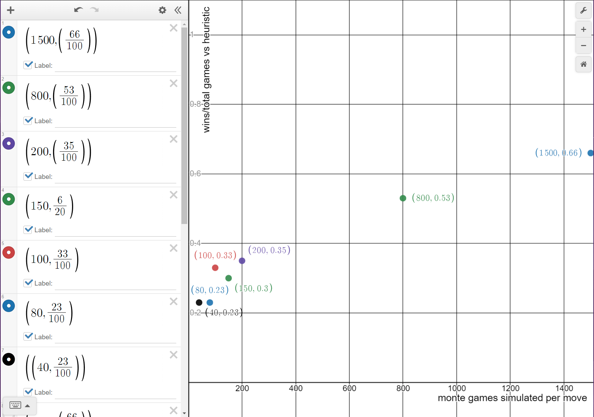
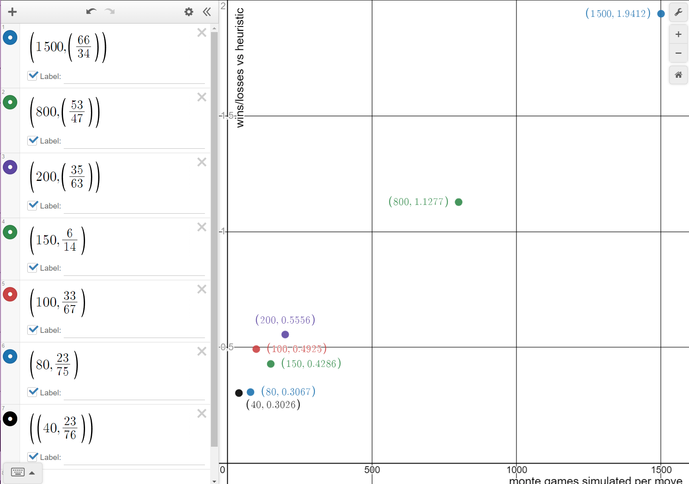
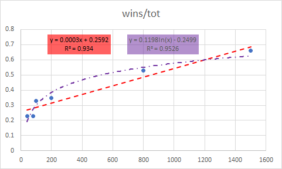
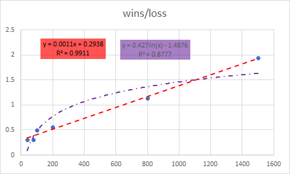

# Connect Four Monte Carlo

## Files

- `c4_monte.py` contains my Monte Carlo class and some driver code
- `c4_heur.py` contains the heuristic agent from last homework

## Game Design Thoughts

In theory from a design perspective I think I should have refactored everything to have a separate game board class and then two agent classes that just play on the boards. But the way I did it now, when I have the monte carlo version play against the heuristic version, they each have a full copy of the game state which is a little silly. Oh well.

I also added a load game and save game function to each of them in order to go back to a previous state very easily without needing to implement undo and redo move functions etc. It also makes everything much easier to analyze because I can print out a specific game state and load it up if I want etc. There are also helper functions that load just one move.

I made sure that the heuristic agent and the monte carlo agent had the same named functions for loading and playing moves (and even made a wrapper method called `our_move()` for both of them that just calls the method for the specific class that gives the next move - using monte carlo or the heuristic). This fake polymorphism would have been better, again, if I just made both agents into their own classes (that maybe inherit some super agent class) and had the game board be separate. Whatever.

## Monte Carlo Implementation

The monte carlo implementation is very straightforward. In a nutshell, for each of the $x$ possible moves (0 <= $x$ <= 7) in a given turn, the agent runs $n$ simulations for each of them ($n$ is default 100) where each simulation game is played out randomly. The move $x_i$ with the highest win to loss ratio is then selected to be played.

Note: I was not sure how to implicitly account for draws. There are a few different ways to rank the moves, either just which one got the most wins (really is wins/totalGames), or the highest win/loss (really wins/(totalGames-draws-wins)), or the one with the least losses (really losses/totalGames) etc...

### Technicalities

Technically, here's how this works: the agent calls `monte()` (or `our_move()` which just wraps `monte()` for the monte agent) to find the column to play.

- We save our current state which might look like "4444" (1 indexed). Then for each of the valid locations we append the move (making sure to account for 1 or 0 indexing) and do $n$ random simulation trials - which might look like loading and simulating each of "44441", "44442", ..., "44447".
  - To actually run the $n$ trials, we call `monte_trials()` on each of them, passing in a "loaded game" that we loaded from that save string (like "44441"), and the AI's color.
  - Then it simulates $n$ games (all playing out randomly using `random_finish()`) and returns a tuple of the (wins, losses).
- Back in the `monte()` method we return the column of the move with the highest win to loss ratio (avoiding a divide by 0 error if we don't lose by adding a really small number. this is a dumb hack-ey way to fix this but whatever). Note that if there's a tie of best moves we pick randomly.

Also I added a `go()` method which takes in the other player's move and has the AI agent make its best move. Ie one full round of play given the opponent's move. I use this mainly in the implementation of `monte_vs_rand()` driver function.

## Results

Note that these results were generated with the Monte Carlo agent going first. I assume it would do markedly worse if it went second. This is something I would test if I had more time.
<!-- TODO: test that? -->

A big issue here is performance, especially for how we want to choose $n$, the number of games to simulate, per move $x_i$. By experimentation (mostly playing against my heuristic agent) I found there is a direct relation between number of wins and $n$.

### Monte vs Heuristic

It seems like my Heuristic is very good.

Here's a table of $n$ to various win metrics (mostly for 100 games of monte vs heuristic except as noted):

#### Performance table Monte vs Heuristic

|               | $n=40$ | $n=80$ | $n=100$ | $n=150$ | $n=200$ | $n=800$ | $n=1500$ |
|---------------|--------|--------|---------|---------|---------|---------|----------|
| **Win:Games** | 23:100 | 23:100 | 33:100  | 6:20    | 35:100  | 53:100  | 66:100   |
| **Win:Loss**  | 23:76  | 23:75  | 33:67   | 6:14    | 35:63   | 53:47   | 66:34    |
| **Wins**      | 23     | 23     | 33      | 6       | 35      | 53      | 66       |
| **Losses**    | 76     | 75     | 67      | 14      | 63      | 47      | 34       |
| **Ties**      | 1      | 2      | 0       | 0       | 2       | 0       | 0        |
| **Win/Games** | 0.23   | 0.23   | 0.33    | 0.3     | 0.35    | 0.53    | 0.66     |
| **Win/Loss**  | 0.30   | 0.31   | 0.49    | 0.43    | 0.56    | 1.13    | 1.94     |
|               |        |        |         |         |         |         |          |
| **Tot Time**  | 28.2m  |        | 80.83m  |         |         | 556m    | ~1200m   |
| **Tot Time**  | 0.47h  |        | 1.4hr   |         |         | 9.3hr   | 20hr     |
| **1 Game**    | 16.9s  |        | 48.5s   |         |         | 5.56m   | 12m      |
<!-- | **avg $x_i$** | 2.41s  |        |         |         |         | 47.7s   | 103s     | -->

We can also see graphs for wins/totalGames and wins/losses respectively.

#### Wins/Total Graph

#### Wins/Losses Graph

<!-- #### Time Analysis

It's really staggering how long a game can take when we simulate $n=1500$ games for each of our $x_i$ possibilities. I assumed there are 7 options for $x$ each round when calculating the **time for avg $x_i$** row in the table above, even though the actual average would be lower (in later game especially some columns are filled up and therefore there are fewer $x$ options). But if we keep this as an upper bound, (and I don't think it's that far off), we find that just one $x_i$ simulation at $n=1500$ takes 103 seconds.

From here we extrapolate (from $\displaystyle \left( \frac{t(x_i)}{n} \right) \; \bigg\rvert \; n=1500, \; t(x_i)=103 \text{s}$) that each random game takes just 0.068 seconds.

This should be independent of $n$. So for $n=800$, $t(x_i)=47.7\text{s} \Rightarrow \displaystyle \left( \frac{t(x_i)}{n} \right) = 0.059\text{s}$. I would say that's close enough to 0.068s from above (especially since the 20h estimate for $n=1500$ was an estimate). -->

#### Wins Analysis

I also plotted trend lines for $n$ and wins. Number of iterations $n$ has a linear correlation with time so it's really just a proxy for time. We find that wins/loss has a much better linear best fit than wins/totalGames. This is probably because my implementation picked the move with the highest wins/loss and it might be different if I just did it on the highest number of wins. We can also see in the wins/totalGames graph that there's a good logarithmic fit, showing that there is probably diminishing returns in increasing $n$ because (I am positing that) the heuristic model does clever things like double traps that a random player (even a monte carlo one) might not be able to detect well.

##### Wins/Total Fit

##### Wins/Loss Fit

### Monte vs Random

When we have the MC agent play against a fully random player, it handily wins even with $n$ as low as 10. The first value of $n$ I found where the MC didn't lost once in 100 games against the random player was $n=20$ (I'm sure it's not exact and in a lucky case the random player could still win here).

|              | $n=10$ | $n=15$ | $n=18$ | $n=20$ |
|--------------|--------|--------|--------|--------|
| **Wins**     | 98     | 99     | 99     | 100    |
| **Losses**   | 2      | 1      | 1      | 0      |
| **Games**    | 100    | 100    | 100    | 100    |
|              |        |        |        |        |
| **Tot Time** | 3.67m  | 5.85m  | 6.37m  | 7.10m  |

## Bonus thoughts

### Loss Analysis

I tried to see if I could find a pattern to when MC loses (with $n=1000$) to the heuristic and I was expecting to see things like double traps etc by the heuristic, but there are also a lot of goofs, like this game 4453765544537373 where yellow clearly has 3 in a row and red doesn't block, instead just adding to its own stack making a three in a row. It obviously lost on the next move. Derp.

This one is more like what I was expecting (playing under a win condition on a diagonal) 4435123354544255.

I think if both random players in MC had the added smartness of always playing a winning move if available, the MC agent would be better.

### Threading

I was thinking that if we are actually playing a human, we should have the AI run the simulations asynchronously. This has the added benefit that if the human takes a long time to decide what to do, we can have the AI keep running more games (more than $n$) until the human actually goes, which would give us better moves at no cost. Unfortunately I learned that python is not very conducive to fully async and parallel multithreading (at least with the default CPython interpreter, specifically the GIL).

I also wanted to run my numerical analysis results of my heuristic agent vs the monte carlo agent in parallel (8x speed up, in theory) but I couldn't get that to actually speed anything up either... Ugh.

Time to rewrite this whole thing in C for major speedup and parallel capabilities??
