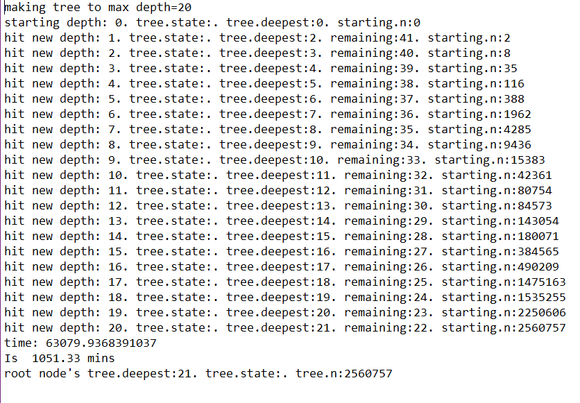
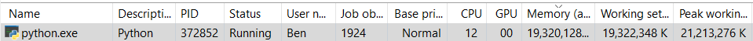
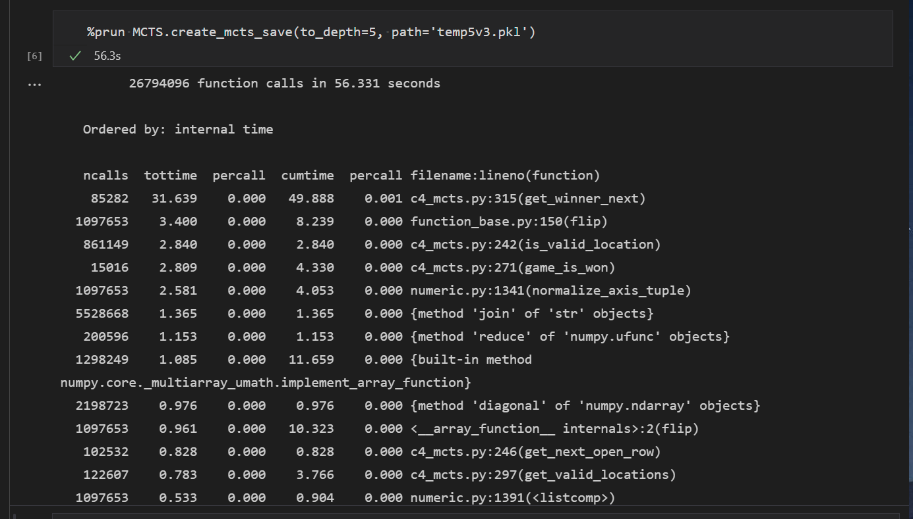
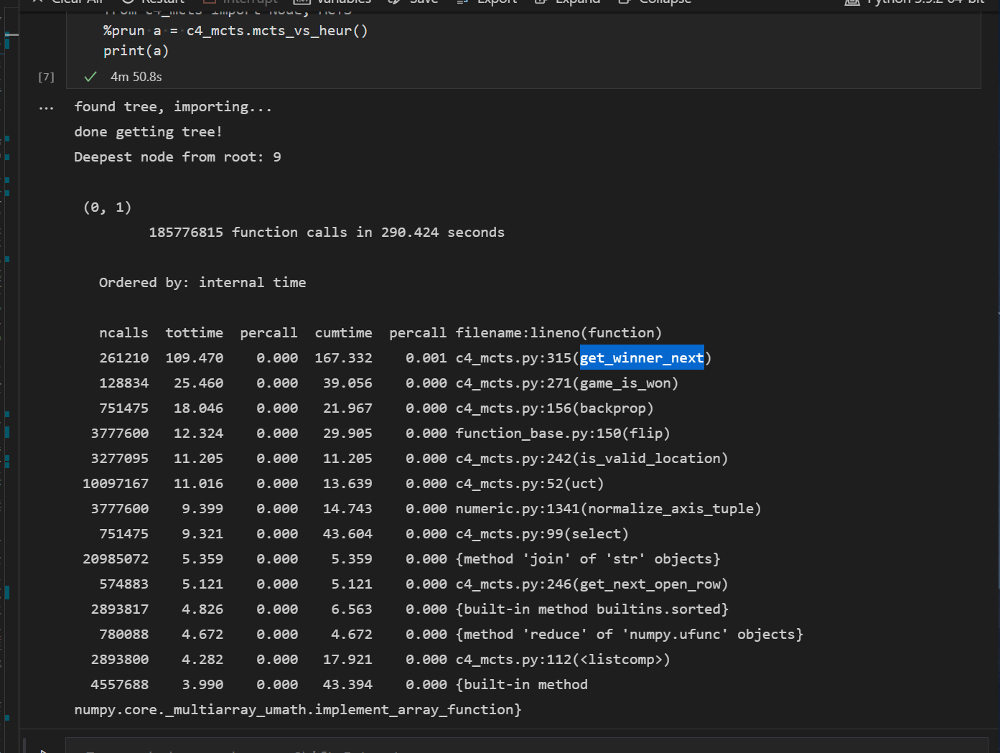

# Monte Carlo Tree Search

## Files

- `c4_mcts.py` is the main code for the assignment that contains the `MCTS` class which is our agent and a `Node` class that is used as the tree
- `c4_heur.py` is the heuristic agent from 2 assignments ago (and my "previous best" agent)
- f`make{n}.py` where $n \in \{8,15,20\}$ is example driver code to generate trees up to depth $n$
- f`mctsV{agent}{n}` where $agent \in \{\texttt{heur},\texttt{rand}\} \: n \in \{50,100\} $ is driver code to have `MCTS` play against a different "agent" for $n$ games.
- `tree.7z` is a (7)zipped version of my tree to depth 20 plus 200 heuristic games. More about this later.

## Overview

In theory, MCTS is straightforward. We build a tree where each node is a game state and each child is a potential move. The way I did it, each level of the tree (mod 2) is for that "player" (ie level 0 is player 1's move, level 2 is player 2's, level 3 is player 1's again etc.). Each node includes information about the number of times it was played and "win information" (more about this soon). MCTS is a balance of exploitation and exploration in 4 stages as we discussed in class. Each node is explored by the rollout phase where it finishes the game randomly, hence the Monte Carlo aspect.

My MCTS agent starts by building a tree to some depth (it stops when one selection goes to the target depth) before it starts playing (more or less considered offline) and storing it in a pickle. Every turn it takes some amount of time to "think" where it repeatedly does rounds of MCTS, adding to the starter tree. If it ever doesn't have a move to play for a given state, it takes more time to think, and if that doesn't work then it tries again by calculating to a depth of +2 from where it is.

### Score: Exploitation, Exploration

The win/"score" information of every level is alternated as follows.
<!-- Let pl(n) denote the player corresponding to the depth of a node n. -->
A win for a player is 0 points, win is 1 point, and a tie is 0.5 points. When going up each level for backpropagation, the score of the previous level is subtracted from 1. Hence 1-0=0, 1-1=0, 1-0.5=0.5 and the loss/win/tie actually alternates and corresponds to the proper player at depth n. This way I can use the same tree for both players. I also could have done loss=-1, win=1, tie=0 and multiplied by -1 at every level but whatever.

This win score is then used for the UCT score to determine which node to explore during MCTS. I set the value of c equal to $\sqrt(2)$ like wikipedia suggested. I was thinking that maybe during actual play I should weight the UCT towards exploitation more (by changing c) but I didn't end up doing that.

### Selection

When playing, we select the node that has been visited the most times from our current state. During play, we move the tree to where the opponent went using `Node.get()` (making sure to add the unexplored sibling nodes to explore later if we save this tree) and to the node we select using `our_move()` which is where the main magic happens. `our_move()` calls `timed_search()` or `search()` which in turn repeatedly makes calls to `mcts1()` that does a round of MCTS.

One big difference between "pure" MCTS and my implementation is that in the rollout phase of MCTS we don't play a fully random game; we first check to see if we can win, else we check if we can block an opponent win, and otherwise we play a random move. Similarly, before we use `search()` and `Node.highest()` in `our_move()` to find a move for us to play, we check if we can win or block in `winOrBlock()`. Even given the fact that we have this in the rollout phase, we probably shouldn't need it "twice" also in the `our_move()` method, but I found that this was somewhat of a shortcut to making the agent play better (much less frustrating "AGH WHY DIDN'T YOU WIN, IT WAS RIGHT THERE!!!) and for whatever reason it wasn't picking up on it just in the rollout phase. Maybe this is an indication of a bug somewhere or I just didn't train it long enough (either offline or online) to get it to converge on deciding that it really is the best move. For completeness I argue that this can't be worse that pure random rollout because you **always** want to either win or block (in that order) because those are game ending and you don't care to explore options that don't include those possibilities (kind of hand-wavy but I hope you get what I mean).

### Online tree search

As noted above, in addition to the pregame computations, it also (always) does some amount of online searching. There is a thinking time parameter that changes for how long this happens (it picks a random amount of time between min and max thinking time). There is also a "boost" criterion that shortens the thinking time if we have already explored to a large depth from the current node (the thought being that we need less time to explore if we already have explored a lot here). As I will discuss later, I don't really have a good way to set the amount of exploration to do or a good handle on what metric to use for how much exploration we've done and how good it is. Maybe number of times we've done MCTS from the node is better than the depth? Maybe that's better than time? No idea.

I also added a method called after a "real" game is played (whether vs a human or another AI) that considers the game to be like a rollout and does the backtracking from the ending node. Additionally, there is an option `cleanup()` to save the new tree state of the MCTS instance after games have been played and more MCTS has been done via the online exploration.

## Results

Even from a tree built to a depth of 8, my agent always wins against the Monkeys on Typewriters ie the random agent (granted my MCTS also does more "online" search during the game). This is good and it would be concerning if it didn't at this point.

Unfortunately for me, my heuristic agent keeps proving itself to be "unkillable", ie very strong. It's really good at double traps and surprisingly good at giving the appearance that it's thinking ahead (despite not doing so). Obviously I can tweak the thinking of my MCTS to a huge number and win more often, but using the default thinking time settings (and keep in mind that when I play games back to back the agent has a more developed tree from the online search, albeit a tree that is more focused/concentrated where the enemy "steered" it during those games), it didn't do so well when I started with trees of sizes of 8 or 15. I built a tree to depth 20 and ran 200 heuristic games in blocks of 20 at a time (and saving the tree after each block). Each game has the added searches added to the tree from the games before (plus the starter tree of depth 20). I would think that my agent would do better in games 101 to 200 than in games 0 to 100 because of all the extra online search but it wasn't so profound. As shown, the columns build on the columns to their left.

|            | depth=20 | +heur 0-100 | +heur 101-200 | all heur 200 | +rand 50 |
|------------|----------|-------------|---------------|--------------|----------|
| wins/total |          | 28/100      | 31/100        | 59/200       | 50/50    |
| win %      |          | 28%         | 31%           | 29.5%        | 100%     |
| end size   | 856 MiB  | 983 MiB     | 1055 MiB      | 1055 MiB     | 1178 MiB |

## Notes. Issues. Improvements?

- The number of nodes and the size of the pickle files gets big fast with increasing depths. This makes it slow to load and save etc.
  - Here's the size comparison
    | depth=5 | depth=8 | depth=15 | depth=20 |
    |---------|---------|----------|----------|
    | 0.2 MiB | 3 MiB   | 127 MiB  | 856 MiB  | 
  - You will notice that I included `tree.pkl` which is a tree built to a depth of 20 plus 200 games worth vs heuristic. The original file for this is 1,110,488,103 bytes or 1.03 GiB. The 7zipped version is 55,806,120 bytes or 0.05 GiB or 53 MiB. This is a 19.9 times decrease. Wow. Huge potential for compression here.
- Here is a lazy screenshot of statistics from building to depth 20 
- I could probably split the tree into block or pieces and store those separately and load them as needed which could break up the size of files. This ties into the problem that the working memory for the big trees is HUGE. For example, MCTS vs random using the depth 20 tree (with 200 rounds worth of exploration vs heuristic added) had a working memory of about 21 GB. Holy bananas. Thankfully I have 32 GB of RAM... Yikes. 
- The code is very slow, especially the winOrBlock calculations, but even the backpropagation (that really doesn't have anything fancy in it, really just adding to local vars and getting the parent node) starts to add up. It took almost 18 hours to make a tree to depth 20. Yikes. And it took about 75 minutes to play 50 games against a random opponent (who plays almost instantly), or about 1.5 minutes per game. This obviously is influenced by the thinking time parameter, but that parameter was mostly set because the MCTS itself just takes a long time so to have a good number of rounds I need a long time.
  - Here's (a screenshot of part of) a jupyter profiled run of creating a tree to depth 5. Most if not all of the top methods are from seeing if something is a win, which is done a lot in `winOrBlock()` which is called in rollouts and when deciding what move to make 
  - Similarly, here's (a screenshot of part of) a jupyter profiled run of making a tree to depth 5 and playing against the heuristic agent. In addition to the winner calculations, this also has `backprop()` pretty high up. 
  - Note: I think these might've been from earlier versions but I think they're still relatively true.
- I started using an opening book (using the calculations from connect4.gamesolver.org) but then got annoyed at all the data entry and gave up. If I used this properly I could trim the tree by a lot because it would delete all the game states that don't start with something in the book! (for example player one should always start with the middle column etc).
- I still need a better way to determine "hyperparameters" like the value for c in UCT, the time to search, how to know if we have searched enough for a given depth etc.
- Versioning was hard. If I loaded an old pickle and it didn't have some field that I added later on then I would run into issues and had to `try` and `except AttributeError:` a lot.
- I had issues with my win or block method for a while and in general had annoying little errors that didn't show themselves except in really specific edge cases (games wouldn't end sometimes and it would just keep searching forever for some reason, but I fixed that **somehow**).
- For a while I had a bug where if we added states that were added either by `winOrBlock()` in `our_move()` or by moving the tree to where the opponent played last - both using `Node.get()` - the "sibling" moves of that state were never considered and therefore they never were explored if I saved and reused the modified tree from games using `cleanup()`.

## Conclusion

If I let my implementation train for longer or adjusted the right parameters I think it would do better. My point is that this can be messed with more to achieve optimal play, but it has "good bones" ie the potential is here.
