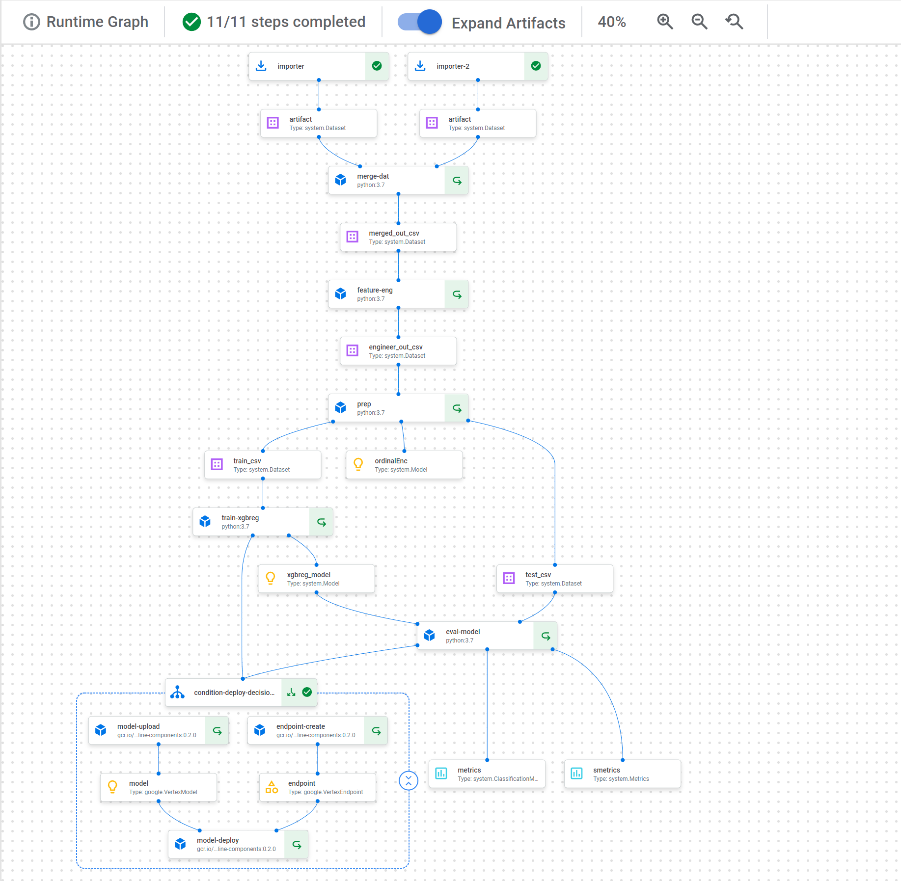

# Rossman Sales Model and Cloud Pipeline Deep Dive

## Overview

This is an XGB Regression model to predict Rossmann drug store daily sales from [this](https://www.kaggle.com/competitions/rossmann-store-sales/overview) dataset/competition on Kaggle. The main purpose of this project is a deep dive of "ML Ops" cloud infrastructure. This demo uses the full modern Google Cloud stack, including importing and creating a training pipeline with Google VertexAI, Kubeflow v2, and Vertex Workbenches. The pipeline is scheduled using Google Cloud Scheduler accessing a Google Cloud Function to run the Vertex job. This demo does not have a frontend, but the video linked below uses Vertex's built in demo to run a prediction.

### Technologies

Flask, Google Cloud Compute Instance (Cloud VM), Google Cloud Functions (Serverless Computing), Google Cloud Scheduler, Google Vertex AI (Cloud ML), Jupyter, Kubeflow Pipelines, Numpy, Pandas, Python, Scikit Learn (ML libraries including encoder, metrics, etc.), XGB Regression (Gradient Boosting ML Model)

### Video Explanation and Demo

Full explanation and demo [here](https://www.youtube.com/watch?v=gyAe1hQdFoA). I think this is the best and easiest way to consume this project.

Please note that some data have either been redacted from the video or the content linked has been deleted.

## Pipeline Architecture

Since the main focus is on the pipeline, here is the pipeline architecure (as explained in the video above):

## Files

There are two folders here:

1. [testing](testing/) has EDA and basic model construction, used while exploring and iterating before moving on to the next section.

1. [prod](prod/) has the code to actually make and run the Vertex pipeline which in turn creates the model and can be run on a schedule. There are two folders within:

    1. [pipeline](prod/pipeline/) has an iPython [notebook](prod/pipeline/pipeline.ipynb) that defines the VertexAI pipeline. This pipeline is compiled down into a [json](prod/pipeline/pipe1.json) document which is loaded by Vertex AI to produce [this](prod/pipeline/pipe.png) pipeline flow. 

    1. [cloud_function](prod/cloud_function/) has the Cloud Function Python [app](prod/cloud_function/main.py) which is called by the Cloud Schedule routine to trigger the VertexAI training job. This simulates a situation where a model would be retrained on a regular schedule.

## Detailed Explanation

### Detailed Pipeline

The pipeline is made up of kfp pipeline components (mostly using Python decorators) and then defined with the kfp pipeline decorator as follows (or a picture of the graph here or at the end of the doc):

- The data are imported from a cloud bucket using the built in “Import” helper components to bring in the two CSVs: train.csv and store.csv
- Those CSVs are merged into one training dataset
- The merged CSV is cleaned up and feature engineered adding and deleting some columns
    - Including making sure the data are sequential and then breaking up the Date column into Day, Month, and Year columns and then deleting the Date column.
- That CSV is sent to be preprocessed, including running an Encoder to convert categorical data. 
    - We also use joblib to save that model to a cloud bucket so we could use it with new data etc. 
    - The dataframe is also split into training and test sets, making sure that we split it such that the model trains on older data than its testing on because it’s timeseries data and it shouldn’t be able to look into the future.
- The training split goes into the custom training component which is training an XGB Regressor. 
    - The model’s score is calculated using sktime’s RMSPE function on the training data. 
    - We make sure to save the model using the XGB library’s dump method and name it model.bst so that VertexAI is happy and we can actually import it into the Vertex “Models” tab later on.
- The model and the testing split go into the evaluation stage where the model predicts on the testing data and we calculate the score using sktime’s RMSPE again. 
    - We set a threshold if we want the model to be deployed based on this testing data’s score. I arbitrarily set the threshold to be “yes” if the model’s RMSPE is below 0.5. Note that a higher RMSPE number is a worse score.
- Now we have conditional block based on the threshold we set above and we therefore conditionally deploy the model and create and endpoint for it if the conditional is a “yes”
    -The model will show up in the “Models” tab in Vertex and the endpoint will show up in the “Endpoints” tab. Nice.

We compile this pipeline into JSON to start a run in the “Jobs” tab in Vertex. The graph of the pipeline and the progress can be followed in the “Pipelines” tab. During testing I was starting the run with the VertexAI API right from the Jupyter Notebook in the Workbench.

Something really nice about this component system and breaking everything up into small pieces like this is that if something fails along the way (like the wrong parameters for a component etc), during the next run the job will pick up from the last component that successfully executed because we have caching turned on. A weird quirk (although probably good that they have it implemented like this in most cases) is that since we’re using traintestsplit to break up the data into training and testing, it assumes that this is a random process and therefore disables caching for everything from this component and onward, DESPITE the fact that we have randomization turned off since we want the split to be linear in time. 

### Cloud Function and Scheduler

There used to be a way to set a schedule for a pipeline job right from the API (you could just specify the cron schedule to run) which would have been very convenient. Unfortunately, this was deprecated after v1 of the API and there’s no real replacement in v2. Ugh. So Google’s official workflow (from their tutorial docs) is to create a serverless Cloud Function and use Cloud Scheduler to trigger it. This seemed like the exact sort of “hacky” thing that I would do but apparently this is the “right” way to do it lol. 

So we do exactly that. We have a Cloud Function that is listening for a POST request with a JSON payload pointing to the cloud bucket location of a compiled pipeline job and just submits it using the VertexAI API (making sure that we don’t await the completion from this function so it doesn’t stay alive until it’s completed, because it’s serverless and we want it to die quickly). 

We then have a Cloud Scheduler set up with the cron schedule to hit the HTTP endpoint of the above function with a JSON payload with the location of the compiled pipeline file in a cloud bucket.

The nice thing about this method is with just the one Cloud Function we can very easily have different Cloud Scheduler jobs with different JSON payloads or at different times or with different parameters that could run completely different pipeline jobs etc because the Cloud Function is essentially just a versatile “pipeline runner”.

### Some Notes

There are a lot of weird growing pains visible in VertexAI, especially the v2 of the API, and Kubeflow and the way everything integrates. 

I couldn’t figure out how to properly set up the training component to use a GPU for training which would have been very nice. It seems simple (you just specify that you want a GPU resource for the training component) and it’s nice and modular because each component is just spinning up a kubernetes instance and it should be the case that just the training component has a GPU allocated which would be great, and it said that the job for the training component had a GPU (and a different CPU SKU which makes sense because it’s a different type of box that has the GPUs) but for some reason it didn’t go any faster than when not requesting a GPU (which is always very suspicious) and the task would fail at the end of the training with a message saying there wasn’t a GPU available. This is despite the fact that this same training code (albeit not inside of a pipeline or Kubeflow or kubernetes) worked with a GPU both on my local machine and through Colab. I gave up on this and on using a GPU for evaluation (the latter of which mattered a lot less to me), but it was very annoying that training took over 10 minutes instead of less than 1 minute. 

