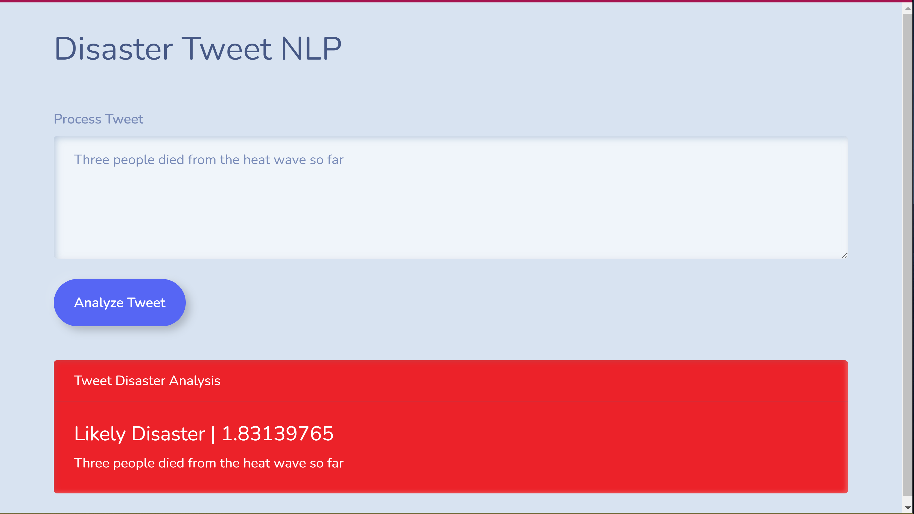
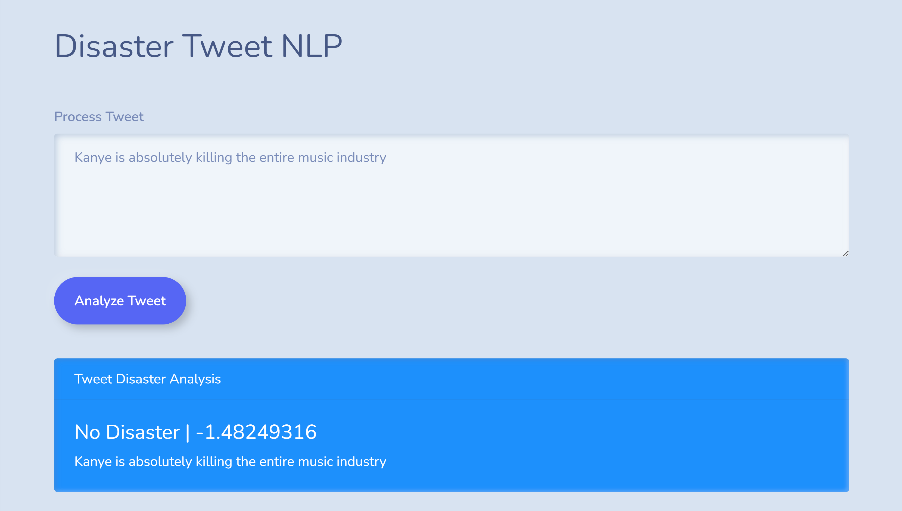

# Twitter NLP Sentiment Analysis Disaster Prediction

See it live! [nlp.bzuckier.com](nlp.bzuckier.com)

## Overview

This is an NLP sentiment analysis model that takes in Tweets from [this Kaggle competition](https://www.kaggle.com/competitions/nlp-getting-started/) and determines if it is about an actual disaster or not (users of Twitter are often known to use hyperbole or sarcasm). The model is deployed on Google Cloud VertexAI, and is targeted by a Google Cloud Function endpoint. 

The interface is actually a static webpage, completely client-side, which handles the input, API calls to the Cloud Function, and displays the results! Nice :)

### Technologies

Deep Neural Network (with Dropout), Flask, Google Cloud Functions (Serverless Computing), Google Vertex AI (Cloud ML), JavaScript, Jupyter, Keras, Numpy, Pandas, Python, TensorFlow 2, Text Embedding (TF2 DNN Language Model), **Vue.JS**

### Video Explanation and Demo

Full explanation and demo [here](). I think this is the best and easiest way to consume this content.

### Just Demo and images

Here's a quick demo (unmute the audio!) of the frontend and model in action.

## Files

There are three folders here:

1. [model](model/) has EDA and the model construction and model export. This is all in a Jupyter [notebook](model/Twitter_NLP_Disaster_EDA_and_Model.ipynb).
    - The model architecture is as follows. A Tensorflow 2 saved Neural Network Language Model text embedding trained on the Google News 7B corpus is loaded from [here](https://tfhub.dev/google/nnlm-en-dim50/2). A Deep Neural Network composed of the embedding layer, 2 dense (fully connected) layers, and 2 dropout layers is compiled and trained. 
1. [cloud_function](cloud_function/) has the Cloud Function Python [app](cloud_function/main.py) which defines the API that takes in a Tweet and runs the prediction on the model.
1. [interface](interface/) has the code for the interface. As already mentioned, is is of note that this code is a static page that runs completely client-side! It is written in Vue.JS and makes API calls to the cloud function. It uses Bootswatch for easy styling. It's hosted really simply (since there's no server) using a Google Cloud Bucket.
